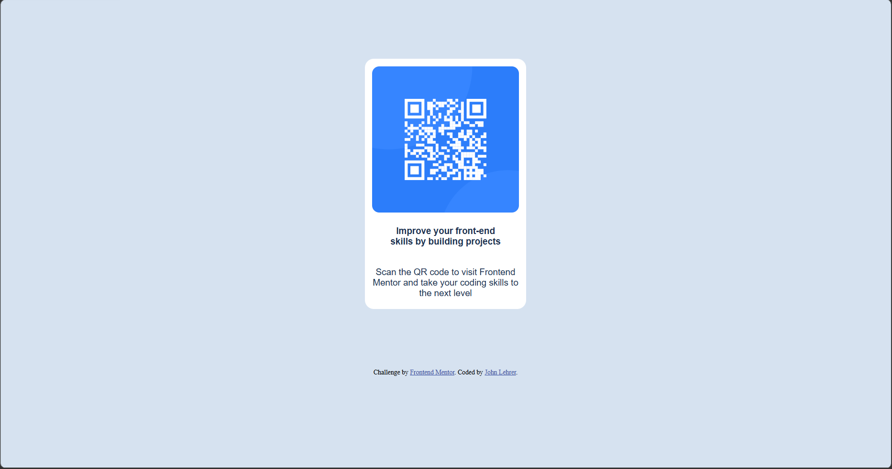

# Frontend Mentor - QR code component solution

This is a solution to the [QR code component challenge on Frontend Mentor](https://www.frontendmentor.io/challenges/qr-code-component-iux_sIO_H). Frontend Mentor challenges help you improve your coding skills by building realistic projects.

## Table of contents

* [Overview](#overview)

  * [Screenshot](#screenshot)
  * [Links](#links)
* [My process](#my-process)

  * [Built with](#built-with)
  * [What I learned](#what-i-learned)
  * [Continued development](#continued-development)
  * [AI Collaboration](#ai-collaboration)
  * [Author](#author)

## Overview

### Screenshot

!\[My Screenshot](./Screenshot.jpg)



### Links

* Solution URL: [https://github.com/JohnLehrer/QR-Code-Component-repo](https://github.com/JohnLehrer/QR-Code-Component-repo)
* Live Site URL: [https://johnlehrer.github.io/QR-Code-Component-repo/](https://johnlehrer.github.io/QR-Code-Component-repo/)

## My process

### Built with

* Semantic HTML5 markup
* CSS table based layout

### What I learned

```css
body {
  background-color: hsl(0, 0%, 0%);
  overflow: hidden;
}
```

I learned hsl (hue, saturation, lightness) in CSS colouring, and how to keep a webpage static using overflow: hidden.

Also, there is more than one way to achieve a desired outcome in coding. True skill and mastery in coding is developed by learning  how to find and use the most efficient way.

For example, structuring cells to contain the items can be done using a table, CSS flexbox, CSS grid..etc. However I used a table. And even under using a table, I initially thought to create individual cells for the items and to represent each space. That works, but I found that I could use a single row for each item and use paddings and margins to create spaces, which is much simpler.

### Continued development

I would want to refine my table formatting techniques, CSS colouring and page manipulations, such as whether the page is fixed, whether it moves, what direction it can, etc

Use this section to outline areas that you want to continue focusing on in future projects. These could be concepts you're still not completely comfortable with or techniques you found useful that you want to refine and perfect.

**Note: Delete this note and the content within this section and replace with your own plans for continued development.**

### AI Collaboration

I used GitHub Copilot within Visual Studio Code to analyze the efficiency of my code, and also to explain new coding techniques/ mechanisms I found by research and how they can be employed in different scenarios. One example is the hsl, I used GitHub Copilot to explain it, so I could understand and employ it elsewhere, not just in this challenge. And generally it was helpful. 

Author

* Frontend Mentor - [@JohnLehrer](https://www.frontendmentor.io/profile/JohnLehrer)

